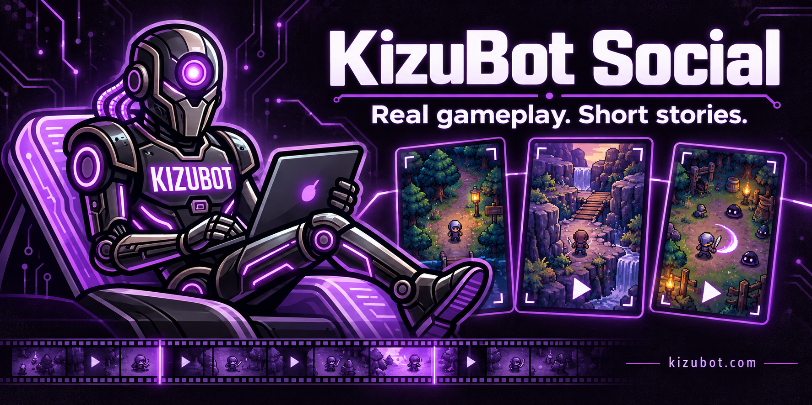
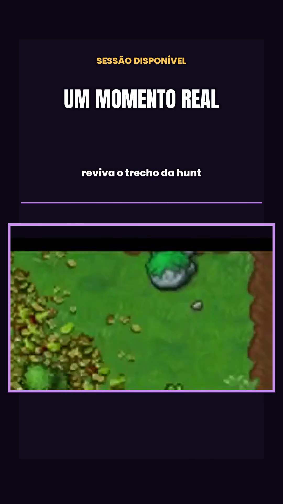
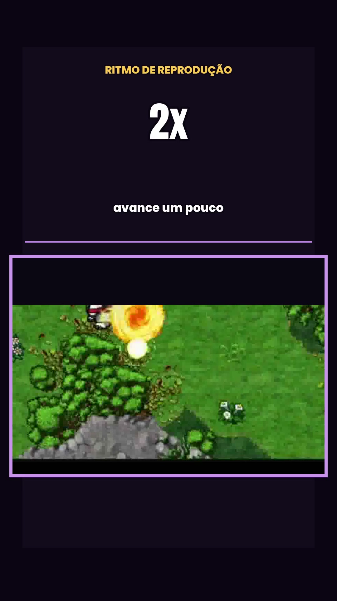
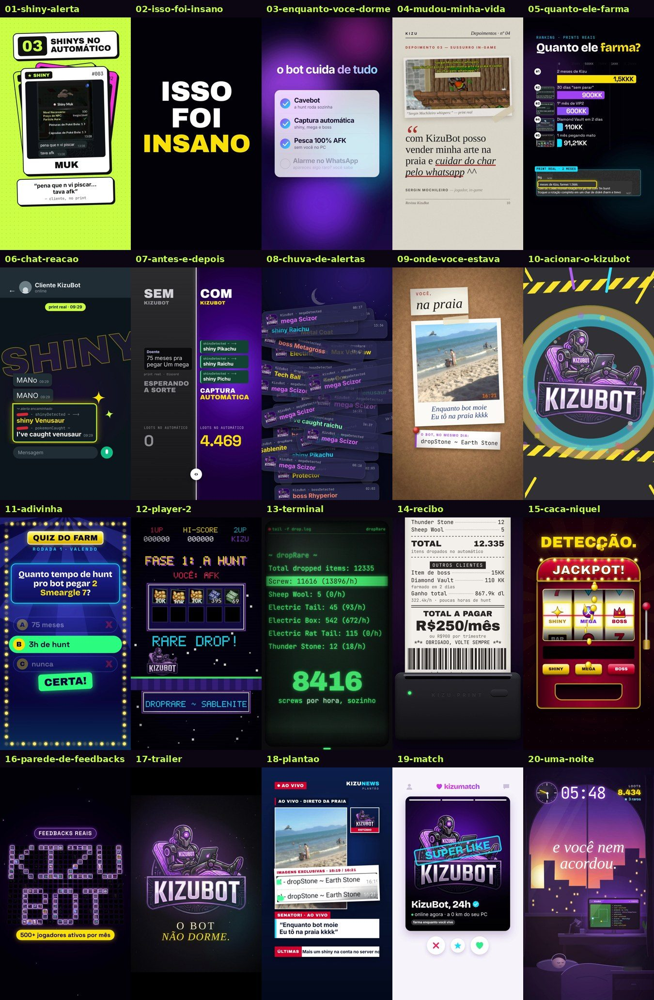

# KizuBot Social

<p align="center">
  <a href="https://kizubot.com">
    
  </a>
</p>

<p align="center">
  <a href="https://kizubot.com"></a>
  <a href="https://www.tiktok.com/@kizubotpxg"></a>
  <a href="https://www.youtube.com/@kizubotpxg"></a>
  <a href="https://www.instagram.com/kizubotpxg/"></a>
</p>

<p align="center"><strong>Real gameplay. Short stories. One recognizable brand.</strong><br><sub>PxG moments · Product explainers · Brazilian Portuguese</sub></p>

## Meet KizuBot Social

**KizuBot Social** is the short-video production project behind KizuBot's TikToks, Instagram Reels and YouTube Shorts. It turns authorized PokeXGames footage and privacy-protected customer recordings into focused stories: a moment worth replaying, a feature worth explaining, or a question the community can answer.

The idea is simple: show the action, make one point, and give viewers a reason to keep watching. Each edit pairs real gameplay with readable captions, deliberate cuts and KizuBot's dark-and-purple visual identity.

**[Meet KizuBot →](https://kizubot.com)** · **[Explore the product docs →](https://www.kizubot.com/docs)**

## A look at the Shorts

<table>
  <tr>
    <td align="center" width="50%">
      <a href="https://www.youtube.com/shorts/xEAFzw1aQQ4"></a>
      <br><strong>A moment worth replaying</strong>
      <br><sub>A customer-recording edit built around a visible hunt moment.</sub>
    </td>
    <td align="center" width="50%">
      <a href="https://www.kizubot.com/changelog/pokexgames-kizubot-ia-offline-cam-painel-alarmes-0905"></a>
      <br><strong>Your replay. Your pace.</strong>
      <br><sub>A production preview explaining Offline Cam playback speed.</sub>
    </td>
  </tr>
</table>

The gallery uses real delivery frames. The cover is an original illustration; its pixel-art scenes establish the visual theme.

Watch the replay example on **[TikTok](https://www.tiktok.com/@kizubotpxg/video/7691831520100732180)**, **[YouTube Shorts](https://www.youtube.com/shorts/xEAFzw1aQQ4)** or **[Instagram Reels](https://www.instagram.com/reel/Dd9_ODDFTEV/)**.

## Motion series

Twenty-one motion-graphics shorts made in code (HyperFrames + GSAP) from real customer prints, from trading-card shiny montages to a movie-trailer parody and a one-night time-lapse. **[See the series →](motion/)**

<p align="center"><a href="motion/"></a></p>

## What makes a KizuBot Short

- **Gameplay leads.** The hook comes from something viewers can actually see: movement, a hunt, an encounter or a replay.
- **One idea per edit.** Practical product explanations sit alongside community prompts and short gameplay stories.
- **Two sources, varied stories.** Alternate footage from the official KizuBot channel with authorized customer recordings, choosing a distinct moment for each short.
- **Privacy is part of the cut.** Hide nicknames and keep personal chats, account details and private panels outside the published frame.
- **Made for the phone.** New edits follow a 9:16 brief, with captions placed where the action stays visible.

The replay examples introduce **Offline Cam**: available hunt sessions can be downloaded and watched in the game client, with playback speeds selected before starting. See the [official feature announcement](https://www.kizubot.com/changelog/pokexgames-kizubot-ia-offline-cam-painel-alarmes-0905) for details.

## Behind the cuts

**Concept → Authorized footage → Script and cuts → Captions and audio → Review → Backup → Platform release**

Production combines visual inspection, full playback review and media checks. The delivery workflow checks resolution, duration, H.264/AAC encoding, subtitles, crops, privacy and audio levels. Release preparation requires verified independent backup copies and a restore test.

A finished master gets its own metadata for each platform. Production stages stay separate: a render, a reviewed video and a confirmed platform post each have their own evidence.

| Skill or tool | Its role |
| --- | --- |
| **KizuBot Offline Cam** | Supplies available gameplay recordings for authorized replay stories. |
| **[Get-Brolls](https://github.com/engenheirodevideo/get-brolls)** | Helps collect candidate footage and review source choices before editing. |
| **viral-shorts-factory** | Guides short-video production, editorial checks and media QC. |
| **[FFmpeg and ffprobe](https://ffmpeg.org/)** | Cut and assemble footage, encode delivery files and inspect audio/video properties. |
| **[Python](https://www.python.org/)** | Connects edit specifications, metadata, manifests and verification steps. |
| **Codex and built-in imagegen** | Coordinate the project work and create this presentation's original cover artwork. |

## Explore this presentation

This package brings together the project story, selected delivery frames and illustrative artwork.

Delivery MP4s are also preserved at the [repository root](https://github.com/Kizuno18/kizubot-social-media/tree/main). Their filenames identify specific delivery encodes.

```text
README.md                 Project introduction and official channels
assets/                   Cover, official mascot and selected video frames
motion/                   Motion-graphics series (21 MP4s) and its index
artwork.md                Cover prompt and artwork provenance
sources.md                Reference study and channel-link evidence
```

Read the [artwork notes](artwork.md) for the cover's creative direction and the [source notes](sources.md) for the reference project and verified links.

## Credits

KizuBot branding belongs to **KizuBot**. Thanks to the customers who authorized recording use, **[engenheirodevideo](https://github.com/engenheirodevideo)** for Get-Brolls, and the maintainers of the production tools.

The presentation takes inspiration from the project introduction in **[Gráfico Aberto's presentation PR](https://github.com/Kizuno18/grafico-aberto-archive/pull/1)**. Game footage and third-party media retain their respective rights and attribution.

---

<p align="center"><strong>A real moment. A clear story. See you in the next Short.</strong><br><a href="https://kizubot.com">kizubot.com</a> · <a href="https://www.tiktok.com/@kizubotpxg">TikTok</a> · <a href="https://www.youtube.com/@kizubotpxg">YouTube</a> · <a href="https://www.instagram.com/kizubotpxg/">Instagram</a></p>
