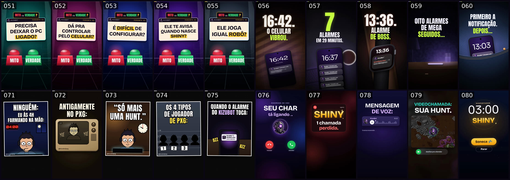
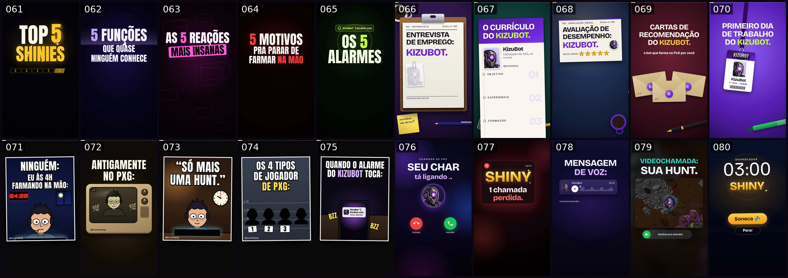
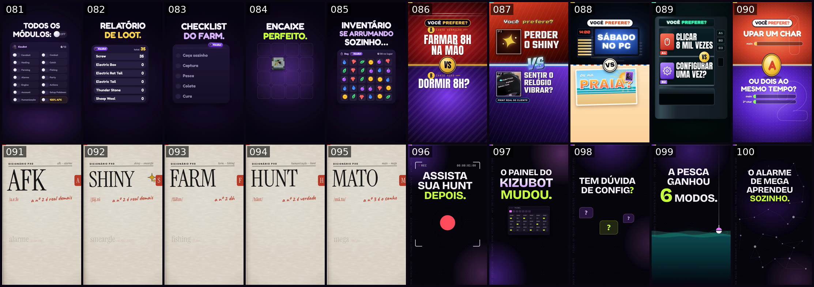
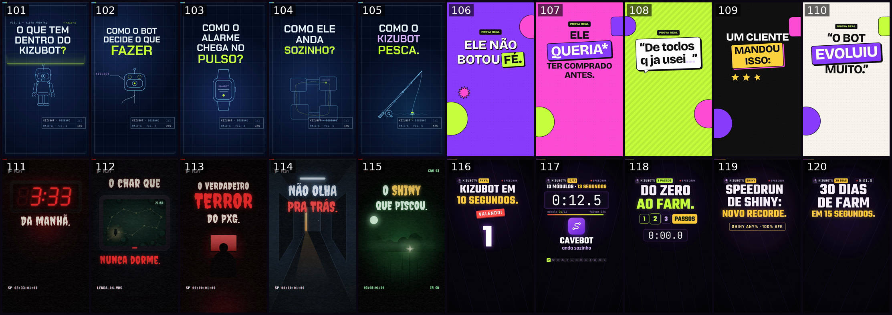
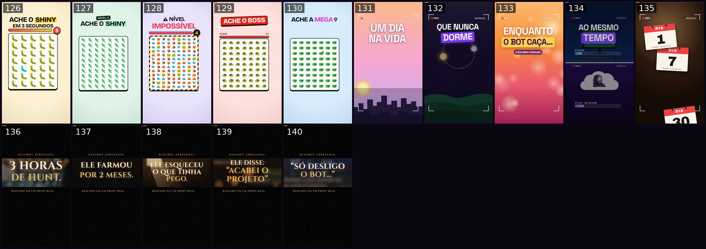

# Série Neuro (041–140)

Cem shorts verticais (1080×1920, 30 fps, 12–25 s) para o KizuBot, feitos inteiramente em código: composições HTML/GSAP renderizadas com [HyperFrames](https://github.com/heygen-com/hyperframes), trilha original sintetizada (sem samples nem licenças) e efeitos sonoros, com áudio normalizado em −14 LUFS. Cada short aplica de propósito uma ou mais técnicas de neuromarketing e retenção, e usa só material real: o logo oficial, prints de clientes publicados no kizubot.com (com nomes, rostos e dados pessoais removidos) e gameplay real do site.

<p align="center"></p>

<p align="center"></p>

<p align="center"></p>

<p align="center"></p>

<p align="center"></p>

## Como a série foi pensada

Vinte formatos recorrentes × cinco episódios. Formato recorrente é o que faz o público reconhecer o vídeo em meio segundo, maratonar a série e lembrar da marca (efeito de mera exposição). Todos seguem as mesmas regras: gancho legível em 0,4 s com movimento e som no primeiro frame, um novo motivo para continuar assistindo a cada 5–7 s, revelação no drop da música, prova real, card final com logo, brilho no olho do robô, kizubot.com e o mesmo logo sonoro, e final que emenda no começo para virar loop.

| Série | IDs | Alavanca principal |
| --- | --- | --- |
| F01 A Conta | 041–045 | aversão à perda + ancoragem |
| F02 POV | 046–050 | autorreferência + narrativa |
| F03 Mito ou Verdade? | 051–055 | lacuna de curiosidade + compromisso (palpite) |
| F04 Espera o Alarme | 056–060 | antecipação / recompensa variável |
| F05 Top 5 | 061–065 | loop aberto (o #1 no fim) |
| F06 Currículo do KizuBot | 066–070 | humor (violação benigna) + ancoragem |
| F07 Só Quem Joga PxG Entende | 071–075 | identidade de grupo + humor + compartilhamento |
| F08 Ligação Recebida | 076–080 | interrupção de padrão (ligação) |
| F09 Satisfatório | 081–085 | recompensa sensorial + loop |
| F10 Você Prefere? | 086–090 | escolha + contraste |
| F11 Dicionário PxG | 091–095 | identidade + incongruência |
| F12 Novidade no KizuBot | 096–100 | novidade + FOMO + autoridade |
| F13 Raio-X | 101–105 | superioridade da imagem + competência |
| F14 Prova Real | 106–110 | prova social + contágio emocional |
| F15 Terror no PxG | 111–115 | suspense + humor + sazonalidade (Halloween) |
| F16 Speedrun | 116–120 | pressão de tempo + fluência + loop |
| F17 Infomercial | 121–125 | empilhamento de valor + ancoragem + nostalgia |
| F18 Ache o Shiny | 126–130 | participação + rewatch + efeito Von Restorff |
| F19 O Dia de Quem Usa | 131–135 | aspiração / future pacing |
| F20 Plot Twist | 136–140 | transporte narrativo + quebra de expectativa |

## Os 100 shorts

| # | Arquivo | Série | Título | Gancho | Técnicas |
| --- | --- | --- | --- | --- | --- |
| 041 | [`041-a-conta.mp4`](041-a-conta.mp4) | F01 A Conta | A conta que ninguém faz | VOCÊ DORME 8H POR DIA. | loss-aversion, anchoring, self-reference, pattern-interrupt, peak-end, comment-prompt |
| 042 | [`042-seu-expediente.mp4`](042-seu-expediente.mp4) | F01 A Conta | Seu char trabalha menos que você | SEU CHAR TRABALHA MENOS QUE VOCÊ. | loss-aversion, anchoring, self-reference, pattern-interrupt, benign-violation-humor, peak-end, bookend-loop, comment-prompt |
| 043 | [`043-preco-de-um-lanche.mp4`](043-preco-de-um-lanche.mp4) | F01 A Conta | R$ 250 é caro? | R$ 250 POR MÊS. É CARO? | anchoring, price-reframing, loss-aversion, self-reference, contrast, social-proof, peak-end, comment-prompt |
| 044 | [`044-oito-mil-loots.mp4`](044-oito-mil-loots.mp4) | F01 A Conta | 8.434 loots desde cedo | 8.434 LOOTS. NINGUÉM ENCOSTOU NO MOUSE. | precise-numbers, social-proof, loss-aversion, benign-violation-humor, anchoring, peak-end, comment-prompt |
| 045 | [`045-fim-de-semana.mp4`](045-fim-de-semana.mp4) | F01 A Conta | Seu fim de semana tem 48 horas | SEU FIM DE SEMANA TEM 48 HORAS. | loss-aversion, self-reference, aspiration, social-proof, contrast, peak-end, comment-prompt |
| 046 | [`046-pov-acorda-com-shiny.mp4`](046-pov-acorda-com-shiny.mp4) | F02 POV | POV: você acorda e o shiny já tá na conta | POV: você acorda e o shiny já tá na conta. | pov-self-reference, narrative-transport, curiosity-gap, schema-violation, social-proof-twist, peak-end, seamless-loop, comment-prompt |
| 047 | [`047-pov-academia.mp4`](047-pov-academia.mp4) | F02 POV | POV: treino de perna e o relógio vibra | POV: treino de perna e o relógio vibra. | pov-self-reference, narrative-transport, precise-number, humor-benign-violation, match-cut-proof, social-proof, peak-end, comment-prompt |
| 048 | [`048-pov-praia.mp4`](048-pov-praia.mp4) | F02 POV | POV: você foi pra praia e o bot ficou farmando | POV: você foi pra praia. | pov-self-reference, narrative-transport, countdown-anticipation, social-proof, in-group-identity, peak-end, comment-prompt |
| 049 | [`049-pov-2h-da-manha.mp4`](049-pov-2h-da-manha.mp4) | F02 POV | POV: 2h da manhã, o boss nasceu e você tá deitado | POV: 2h da manhã. O boss nasceu. | pov-self-reference, narrative-transport, precise-timestamps, anticipation, social-proof-twist, peak-end, seamless-loop, comment-prompt |
| 050 | [`050-pov-filme-com-a-namorada.mp4`](050-pov-filme-com-a-namorada.mp4) | F02 POV | POV: filme com a namorada e o celular vibra | POV: filme com a namorada e o celular vibra. | pov-self-reference, curiosity-gap, variable-reward-reveal, narrative-transport, social-proof-twist, peak-end, comment-prompt |
| 051 | [`051-precisa-pc-ligado.mp4`](051-precisa-pc-ligado.mp4) | F03 Mito ou Verdade? | Mito ou verdade: precisa deixar o PC ligado? | MITO OU VERDADE? PRECISA DEIXAR O PC LIGADO? | curiosity-gap, commitment-guess, objection-handling, anticipation-drop, schema-violation, social-proof, loop |
| 052 | [`052-controla-pelo-celular.mp4`](052-controla-pelo-celular.mp4) | F03 Mito ou Verdade? | Mito ou verdade: dá pra controlar pelo celular? | MITO OU VERDADE? DÁ PRA CONTROLAR PELO CELULAR? | curiosity-gap, commitment-guess, objection-handling, anticipation-drop, picture-superiority, social-proof |
| 053 | [`053-dificil-configurar.mp4`](053-dificil-configurar.mp4) | F03 Mito ou Verdade? | Mito ou verdade: é difícil de configurar? | MITO OU VERDADE? É DIFÍCIL DE CONFIGURAR? | curiosity-gap, commitment-guess, objection-handling, social-proof, ikea-effect, anticipation-drop |
| 054 | [`054-avisa-shiny.mp4`](054-avisa-shiny.mp4) | F03 Mito ou Verdade? | Mito ou verdade: ele te avisa quando nasce shiny? | MITO OU VERDADE? ELE TE AVISA QUANDO NASCE SHINY? | curiosity-gap, commitment-guess, anticipation-drop, variable-reward, pavlovian-sound, social-proof |
| 055 | [`055-joga-igual-robo.mp4`](055-joga-igual-robo.mp4) | F03 Mito ou Verdade? | Mito ou verdade: ele joga igual robô? | MITO OU VERDADE? ELE JOGA IGUAL ROBÔ? | curiosity-gap, commitment-guess, objection-handling, contrast, social-proof, anticipation-drop |
| 056 | [`056-16h42.mp4`](056-16h42.mp4) | F04 Espera o Alarme | 16:42. O celular vibrou. | 16:42. O CELULAR VIBROU. | anticipation, reward-prediction-error, curiosity-gap, sonic-conditioning, precise-number, real-proof, peak-end, comment-prompt |
| 057 | [`057-7-alarmes.mp4`](057-7-alarmes.mp4) | F04 Espera o Alarme | 7 alarmes em 29 minutos | 7 ALARMES EM 29 MINUTOS. | anticipation, variable-reward, counting, precise-number, curiosity-gap, real-proof, self-reference, comment-prompt |
| 058 | [`058-13h36-boss.mp4`](058-13h36-boss.mp4) | F04 Espera o Alarme | 13:36. Alarme de boss. | 13:36. ALARME DE BOSS. | anticipation, curiosity-gap, variable-reward, precise-number, real-proof, emotional-contagion, game-ui-familiarity, comment-prompt |
| 059 | [`059-oito-megas.mp4`](059-oito-megas.mp4) | F04 Espera o Alarme | Oito alarmes de mega seguidos… | OITO ALARMES DE MEGA SEGUIDOS… | anticipation, humor-benign-violation, expectation-subversion, precise-number, real-proof, self-reference, comment-prompt |
| 060 | [`060-notificacao-captura.mp4`](060-notificacao-captura.mp4) | F04 Espera o Alarme | Primeiro a notificação. Depois… | PRIMEIRO A NOTIFICAÇÃO. DEPOIS… | anticipation, sonic-conditioning, two-act-reveal, curiosity-gap, real-proof, loop-bridge, comment-prompt |
| 061 | [`061-top-5-shinies.mp4`](061-top-5-shinies.mp4) | F05 Top 5 | Top 5 shinies que clientes pegaram com o KizuBot | TOP 5 SHINIES QUE CLIENTES PEGARAM COM O KIZUBOT. | open-loop, curiosity-gap, variable-reward, serial-position, visible-progress, social-proof, anticipation-drop, peak-end, comment-prompt |
| 062 | [`062-5-funcoes-escondidas.mp4`](062-5-funcoes-escondidas.mp4) | F05 Top 5 | 5 funções do KizuBot que quase ninguém conhece | 5 FUNÇÕES QUE QUASE NINGUÉM CONHECE (DO KIZUBOT). | open-loop, curiosity-gap, novelty, visible-progress, authority, picture-superiority, peak-end, comment-prompt |
| 063 | [`063-5-reacoes.mp4`](063-5-reacoes.mp4) | F05 Top 5 | As 5 reações mais insanas dos clientes do KizuBot | AS 5 REAÇÕES MAIS INSANAS DOS CLIENTES. | open-loop, social-proof, emotional-contagion, humor, variable-reward, visible-progress, peak-end, comment-prompt |
| 064 | [`064-5-motivos.mp4`](064-5-motivos.mp4) | F05 Top 5 | 5 motivos pra parar de farmar na mão | 5 MOTIVOS PRA PARAR DE FARMAR NA MÃO. | loss-aversion, open-loop, humor, self-reference, visible-progress, contrast, peak-end, comment-prompt |
| 065 | [`065-5-alarmes.mp4`](065-5-alarmes.mp4) | F05 Top 5 | Os 5 alarmes que todo jogador quer receber | OS 5 ALARMES QUE TODO JOGADOR QUER RECEBER. | open-loop, anticipation, conditioning-sound, variable-reward, visible-progress, social-proof, peak-end, comment-prompt |
| 066 | [`066-entrevista-de-emprego.mp4`](066-entrevista-de-emprego.mp4) | F06 Currículo do KizuBot | Entrevista de emprego do KizuBot | ENTREVISTA DE EMPREGO: KIZUBOT. | benign-violation-humor, personification, schema-violation-hook, anchoring, authority, progress-cue, peak-end, comment-prompt |
| 067 | [`067-curriculo.mp4`](067-curriculo.mp4) | F06 Currículo do KizuBot | O currículo do KizuBot | O CURRÍCULO DO KIZUBOT. | benign-violation-humor, personification, self-reference, progress-cue, asmr-typing, social-proof, comment-prompt |
| 068 | [`068-avaliacao-de-desempenho.mp4`](068-avaliacao-de-desempenho.mp4) | F06 Currículo do KizuBot | Avaliação de desempenho do KizuBot | AVALIAÇÃO DE DESEMPENHO: KIZUBOT. | benign-violation-humor, personification, variable-reward-stars, progress-cue, social-proof, peak-end, comment-prompt |
| 069 | [`069-cartas-de-recomendacao.mp4`](069-cartas-de-recomendacao.mp4) | F06 Currículo do KizuBot | Cartas de recomendação do KizuBot | CARTAS DE RECOMENDAÇÃO DO KIZUBOT. | social-proof, authority, curiosity-gap, personification, peak-end, comment-prompt |
| 070 | [`070-primeiro-dia.mp4`](070-primeiro-dia.mp4) | F06 Currículo do KizuBot | Primeiro dia de trabalho do KizuBot | PRIMEIRO DIA DE TRABALHO DO KIZUBOT. | benign-violation-humor, personification, commitment-ladder-checklist, ikea-setup-steps, social-proof, fluent-slogan, comment-prompt |
| 071 | [`071-ninguem-eu-4h.mp4`](071-ninguem-eu-4h.mp4) | F07 Só Quem Joga PxG Entende | Ninguém: / Eu às 4h da manhã | NINGUÉM: / EU ÀS 4H FARMANDO NA MÃO: | in-group-identity, benign-violation-humor, pattern-interrupt, curiosity-gap, social-proof, peak-end, comment-prompt |
| 072 | [`072-antigamente-x-hoje.mp4`](072-antigamente-x-hoje.mp4) | F07 Só Quem Joga PxG Entende | Antigamente no PxG x hoje | ANTIGAMENTE NO PXG: | nostalgia, in-group-identity, contrast, social-proof, loop, comment-prompt |
| 073 | [`073-so-mais-uma-hunt.mp4`](073-so-mais-uma-hunt.mp4) | F07 Só Quem Joga PxG Entende | "Só mais uma hunt." | “SÓ MAIS UMA HUNT.” | in-group-identity, benign-violation-humor, contrast, future-pacing, social-proof, comment-prompt |
| 074 | [`074-tipos-de-jogador.mp4`](074-tipos-de-jogador.mp4) | F07 Só Quem Joga PxG Entende | Os 4 tipos de jogador de PxG | OS 4 TIPOS DE JOGADOR DE PXG: | in-group-identity, self-reference, open-loop, benign-violation-humor, social-proof, comment-prompt |
| 075 | [`075-quando-o-alarme-toca.mp4`](075-quando-o-alarme-toca.mp4) | F07 Só Quem Joga PxG Entende | Quando o alarme do KizuBot toca: | QUANDO O ALARME DO KIZUBOT TOCA: | in-group-identity, emotional-contagion, social-proof, variable-reward, sonic-branding, comment-prompt |
| 076 | [`076-seu-char-ligando.mp4`](076-seu-char-ligando.mp4) | F08 Ligação Recebida | Seu char está ligando… | SEU CHAR TÁ LIGANDO… | pattern-interrupt, sonic-branding, curiosity-gap, humor, social-proof, anticipation-drop, peak-end, comment-prompt |
| 077 | [`077-chamada-perdida-shiny.mp4`](077-chamada-perdida-shiny.mp4) | F08 Ligação Recebida | 1 chamada perdida: SHINY | SHINY — 1 CHAMADA PERDIDA. | pattern-interrupt, loss-aversion, contrast, social-proof, precise-number, anticipation-drop, peak-end, comment-prompt |
| 078 | [`078-mensagem-de-voz.mp4`](078-mensagem-de-voz.mp4) | F08 Ligação Recebida | Mensagem de voz do seu bot | MENSAGEM DE VOZ: KIZUBOT (0:12) | pattern-interrupt, sonic-branding, curiosity-gap, social-proof, precise-number, visible-progress, comment-prompt |
| 079 | [`079-videochamada.mp4`](079-videochamada.mp4) | F08 Ligação Recebida | Videochamada com a sua hunt | VIDEOCHAMADA: SUA HUNT. | pattern-interrupt, sonic-branding, self-reference, picture-superiority, anticipation-drop, comment-prompt |
| 080 | [`080-despertador-shiny.mp4`](080-despertador-shiny.mp4) | F08 Ligação Recebida | Despertador: 03:00 — SHINY | 03:00 — SHINY | pattern-interrupt, sonic-branding, humor, social-proof, anticipation-drop, peak-end, comment-prompt |
| 081 | [`081-todos-os-modulos-on.mp4`](081-todos-os-modulos-on.mp4) | F09 Satisfatório | Todos os módulos: ON | TODOS OS MÓDULOS: OFF → ON | sensory-reward, closure, visible-progress, anticipation, seamless-loop, comment-prompt |
| 082 | [`082-barras-de-loot.mp4`](082-barras-de-loot.mp4) | F09 Satisfatório | Relatório de loot: 12.335 itens | RELATÓRIO DE LOOT. | sensory-reward, closure, visible-progress, precise-number, social-proof, seamless-loop, comment-prompt |
| 083 | [`083-checklist-perfeito.mp4`](083-checklist-perfeito.mp4) | F09 Satisfatório | Checklist do farm (perfeito) | CHECKLIST DO FARM. | sensory-reward, closure, visible-progress, humor, seamless-loop, comment-prompt |
| 084 | [`084-encaixe-perfeito.mp4`](084-encaixe-perfeito.mp4) | F09 Satisfatório | Encaixe perfeito | ENCAIXE PERFEITO. | sensory-reward, closure, social-proof, anticipation, seamless-loop, comment-prompt |
| 085 | [`085-inventario-organizado.mp4`](085-inventario-organizado.mp4) | F09 Satisfatório | Inventário se arrumando sozinho | INVENTÁRIO SE ARRUMANDO SOZINHO… | sensory-reward, closure, visible-progress, order-from-chaos, seamless-loop, identity-question |
| 086 | [`086-farmar-ou-dormir.mp4`](086-farmar-ou-dormir.mp4) | F10 Você Prefere? | Você prefere: farmar 8h na mão ou dormir 8h? | VOCÊ PREFERE? FARMAR 8H NA MÃO OU DORMIR 8H? | forced-choice, contrast-effect, loss-aversion, humor, anticipation-drop, social-proof, comment-prompt |
| 087 | [`087-perder-ou-vibrar.mp4`](087-perder-ou-vibrar.mp4) | F10 Você Prefere? | Você prefere: perder o shiny ou sentir o relógio vibrar? | VOCÊ PREFERE? PERDER O SHINY OU SENTIR O RELÓGIO VIBRAR? | forced-choice, contrast-effect, loss-aversion, nostalgia, pavlovian-sound, social-proof, comment-prompt |
| 088 | [`088-pc-ou-praia.mp4`](088-pc-ou-praia.mp4) | F10 Você Prefere? | Você prefere: sábado no PC ou na praia? | VOCÊ PREFERE? SÁBADO NO PC OU NA PRAIA? | forced-choice, contrast-effect, aspiration, loss-aversion, social-proof, comment-prompt |
| 089 | [`089-clicar-ou-configurar.mp4`](089-clicar-ou-configurar.mp4) | F10 Você Prefere? | Você prefere: clicar 8 mil vezes ou configurar uma? | VOCÊ PREFERE? CLICAR 8 MIL VEZES OU CONFIGURAR UMA? | forced-choice, contrast-effect, effort-heuristic, humor, precise-number, social-proof, comment-prompt |
| 090 | [`090-um-ou-dois-chars.mp4`](090-um-ou-dois-chars.mp4) | F10 Você Prefere? | Você prefere: upar um char ou dois ao mesmo tempo? | VOCÊ PREFERE? UPAR UM CHAR OU DOIS AO MESMO TEMPO? | forced-choice, contrast-effect, humor, social-proof, aspiration, comment-prompt |
| 091 | [`091-afk.mp4`](091-afk.mp4) | F11 Dicionário PxG | Dicionário PxG: AFK | AFK | in-group-identity, incongruity-humor, processing-fluency, pattern-interrupt, social-proof, comment-prompt |
| 092 | [`092-shiny.mp4`](092-shiny.mp4) | F11 Dicionário PxG | Dicionário PxG: Shiny | SHINY | in-group-identity, incongruity-humor, processing-fluency, loss-aversion, social-proof, comment-prompt |
| 093 | [`093-farm.mp4`](093-farm.mp4) | F11 Dicionário PxG | Dicionário PxG: Farm | FARM | in-group-identity, incongruity-humor, processing-fluency, benign-violation-humor, social-proof, comment-prompt |
| 094 | [`094-hunt.mp4`](094-hunt.mp4) | F11 Dicionário PxG | Dicionário PxG: Hunt | HUNT | in-group-identity, incongruity-humor, processing-fluency, competence, social-proof, comment-prompt |
| 095 | [`095-mato.mp4`](095-mato.mp4) | F11 Dicionário PxG | Dicionário PxG: Mato | MATO | in-group-identity, incongruity-humor, processing-fluency, social-proof, relief, comment-prompt |
| 096 | [`096-offline-cam.mp4`](096-offline-cam.mp4) | F12 Novidade no KizuBot | Agora dá pra assistir sua hunt depois | ASSISTA SUA HUNT DEPOIS. | novelty, curiosity-gap, visible-progress, anticipation-drop, picture-superiority, authority, loop, comment-prompt |
| 097 | [`097-painel-novo.mp4`](097-painel-novo.mp4) | F12 Novidade no KizuBot | O painel do KizuBot mudou | O PAINEL DO KIZUBOT MUDOU. | novelty, authority, visible-progress, anticipation-drop, satisfying-micro-motion, social-proof, loop, comment-prompt |
| 098 | [`098-kizuai.mp4`](098-kizuai.mp4) | F12 Novidade no KizuBot | Tem dúvida de config? Pergunta pra IA. | TEM DÚVIDA DE CONFIG? | novelty, self-reference, curiosity-gap, authority, processing-fluency, anticipation-drop, loop, comment-prompt |
| 099 | [`099-pesca-6-modos.mp4`](099-pesca-6-modos.mp4) | F12 Novidade no KizuBot | A pesca do KizuBot ganhou 6 modos | A PESCA GANHOU 6 MODOS. | novelty, visible-progress, curiosity-gap, anticipation-drop, satisfying-micro-motion, authority, loop, comment-prompt |
| 100 | [`100-ia-aprendeu-sozinha.mp4`](100-ia-aprendeu-sozinha.mp4) | F12 Novidade no KizuBot | O alarme de mega aprendeu sozinho | O ALARME DE MEGA APRENDEU SOZINHO. | schema-violation, curiosity-gap, anticipation-drop, novelty, authority, picture-superiority, loop, comment-prompt |
| 101 | [`101-dentro-do-kizubot.mp4`](101-dentro-do-kizubot.mp4) | F13 Raio-X | O que tem dentro do KizuBot? | O QUE TEM DENTRO DO KIZUBOT? | curiosity-gap, picture-superiority, visible-progress, competence, anticipation-drop, loop, comment-prompt |
| 102 | [`102-como-ele-decide.mp4`](102-como-ele-decide.mp4) | F13 Raio-X | Como o bot decide o que fazer | COMO O BOT DECIDE O QUE FAZER | curiosity-gap, visible-progress, competence, picture-superiority, anticipation-drop, loop, comment-prompt |
| 103 | [`103-como-o-alarme-chega.mp4`](103-como-o-alarme-chega.mp4) | F13 Raio-X | Como o alarme chega no seu pulso | COMO O ALARME CHEGA NO PULSO? | curiosity-gap, picture-superiority, social-proof, competence, anticipation-drop, self-reference, loop, comment-prompt |
| 104 | [`104-como-ele-anda.mp4`](104-como-ele-anda.mp4) | F13 Raio-X | Como ele anda sozinho | COMO ELE ANDA SOZINHO? | curiosity-gap, picture-superiority, visible-progress, competence, anticipation-drop, satisfying-micro-motion, loop, comment-prompt |
| 105 | [`105-como-ele-pesca.mp4`](105-como-ele-pesca.mp4) | F13 Raio-X | Como o KizuBot pesca | COMO O KIZUBOT PESCA. | curiosity-gap, picture-superiority, competence, visible-progress, anticipation-drop, humor, loop, comment-prompt |
| 106 | [`106-nao-botou-fe.mp4`](106-nao-botou-fe.mp4) | F14 Prova Real | Ele não botou fé no KizuBot | ELE NÃO BOTOU FÉ. | social-proof, emotional-contagion, negative-frame-pivot, curiosity-gap, peak-end, comment-prompt |
| 107 | [`107-queria-ter-comprado-antes.mp4`](107-queria-ter-comprado-antes.mp4) | F14 Prova Real | Ele queria ter comprado o KizuBot antes | ELE QUERIA* TER COMPRADO ANTES. | social-proof, regret-loss-aversion, humor, pattern-recognition, peak-end, comment-prompt |
| 108 | [`108-de-todos-que-ja-usei.mp4`](108-de-todos-que-ja-usei.mp4) | F14 Prova Real | "De todos que já usei…" — clientes sobre o KizuBot | “DE TODOS Q JA USEI…” | social-proof, authority-by-experience, nostalgia, in-group-identity, peak-end, comment-prompt |
| 109 | [`109-cinco-estrelas.mp4`](109-cinco-estrelas.mp4) | F14 Prova Real | Um cliente mandou isso: ⭐⭐⭐⭐⭐ | UM CLIENTE MANDOU ISSO: ⭐⭐⭐⭐⭐ | social-proof, picture-superiority, commitment-checklist, variable-reward, peak-end, comment-prompt |
| 110 | [`110-o-bot-evoluiu.mp4`](110-o-bot-evoluiu.mp4) | F14 Prova Real | "O bot evoluiu muito." — prova real | “O BOT EVOLUIU MUITO.” | social-proof, before-after-contrast, authority, visible-progress, peak-end, comment-prompt |
| 111 | [`111-3h33.mp4`](111-3h33.mp4) | F15 Terror no PxG | 3:33 da manhã. O celular acende sozinho. | 3:33 DA MANHÃ. | arousal-suspense, curiosity-gap, pattern-interrupt, benign-violation, seasonality, social-proof, peak-end, loop |
| 112 | [`112-lenda-do-char.mp4`](112-lenda-do-char.mp4) | F15 Terror no PxG | A lenda do char que nunca dorme | O CHAR QUE NUNCA DORME. | arousal-suspense, self-reference, benign-violation, seasonality, precise-number, social-proof, peak-end, comment-prompt |
| 113 | [`113-terror-do-farm-manual.mp4`](113-terror-do-farm-manual.mp4) | F15 Terror no PxG | O verdadeiro terror do PxG | O VERDADEIRO TERROR DO PXG. | arousal-suspense, benign-violation, pattern-interrupt, loss-aversion, seasonality, in-group-humor, peak-end, comment-prompt |
| 114 | [`114-nao-olha-pra-tras.mp4`](114-nao-olha-pra-tras.mp4) | F15 Terror no PxG | Não olha pra trás (alguém está jogando no seu lugar) | NÃO OLHA PRA TRÁS. | self-reference, arousal-suspense, benign-violation, pattern-interrupt, seasonality, picture-superiority, peak-end, comment-prompt |
| 115 | [`115-o-shiny-que-piscou.mp4`](115-o-shiny-que-piscou.mp4) | F15 Terror no PxG | O shiny que piscou (e ninguém estava olhando) | O SHINY QUE PISCOU. | arousal-suspense, curiosity-gap, loss-aversion, schema-violation, seasonality, social-proof, peak-end, comment-prompt |
| 116 | [`116-kizubot-em-10s.mp4`](116-kizubot-em-10s.mp4) | F16 Speedrun | KizuBot em 10 segundos | KIZUBOT EM 10 SEGUNDOS. VALENDO! | time-pressure, open-loop-timer, chunking, anticipation, peak-end, seamless-loop, challenge-question, brand-sound |
| 117 | [`117-13-modulos.mp4`](117-13-modulos.mp4) | F16 Speedrun | 13 módulos em 13 segundos | 13 MÓDULOS. 13 SEGUNDOS. | time-pressure, chunking, visible-progress, open-loop-timer, rewatch-bait, peak-end, seamless-loop, comment-prompt |
| 118 | [`118-do-zero-ao-farm.mp4`](118-do-zero-ao-farm.mp4) | F16 Speedrun | Do zero ao farm em 3 passos | DO ZERO AO FARM. 3 PASSOS. | time-pressure, chunking, ikea-effect, visible-progress, social-proof, peak-end, seamless-loop, comment-prompt |
| 119 | [`119-speedrun-de-shiny.mp4`](119-speedrun-de-shiny.mp4) | F16 Speedrun | Speedrun de shiny: mesmo minuto | SPEEDRUN DE SHINY: NOVO RECORDE. | anticipation, variable-reward, precise-numbers, social-proof, time-pressure, peak-end, seamless-loop, comment-prompt |
| 120 | [`120-30-dias-em-15s.mp4`](120-30-dias-em-15s.mp4) | F16 Speedrun | 30 dias de farm em 15 segundos | 30 DIAS DE FARM EM 15 SEGUNDOS. | time-pressure, visible-progress, acceleration, social-proof, precise-numbers, peak-end, comment-prompt |
| 126 | [`126-ache-o-shiny-facil.mp4`](126-ache-o-shiny-facil.mp4) | F18 Ache o Shiny | Ache o shiny em 3 segundos | ACHE O SHINY EM 3 SEGUNDOS. | participation, von-restorff, time-pressure, rewatch-loop, effort-contrast, real-proof, comment-prompt |
| 127 | [`127-ache-o-shiny-medio.mp4`](127-ache-o-shiny-medio.mp4) | F18 Ache o Shiny | Nível 2: ache o shiny | NÍVEL 2: ACHE O SHINY. | participation, von-restorff, decoy-effect, time-pressure, rewatch-loop, loss-aversion, real-proof, comment-prompt |
| 128 | [`128-ache-o-shiny-impossivel.mp4`](128-ache-o-shiny-impossivel.mp4) | F18 Ache o Shiny | Nível impossível | NÍVEL IMPOSSÍVEL. | participation, challenge, von-restorff, rewatch-loop, effort-contrast, real-proof, status-identity, comment-prompt |
| 129 | [`129-ache-o-boss.mp4`](129-ache-o-boss.mp4) | F18 Ache o Shiny | Ache o boss | ACHE O BOSS. | participation, von-restorff, time-pressure, game-ui-familiarity, rewatch-loop, real-proof, comment-prompt |
| 130 | [`130-ache-a-mega.mp4`](130-ache-a-mega.mp4) | F18 Ache o Shiny | Ache a mega | ACHE A MEGA. | participation, von-restorff, radar-metaphor, time-pressure, rewatch-loop, real-proof, comment-prompt |
| 131 | [`131-um-dia-na-vida.mp4`](131-um-dia-na-vida.mp4) | F19 O Dia de Quem Usa | Um dia na vida de quem usa KizuBot | UM DIA NA VIDA DE QUEM USA KIZUBOT. | aspiration-future-pacing, narrative-arc, precise-timestamps, social-proof, visible-progress, peak-end, comment-prompt |
| 132 | [`132-char-que-nunca-dorme.mp4`](132-char-que-nunca-dorme.mp4) | F19 O Dia de Quem Usa | A rotina de um char que nunca dorme | A ROTINA DE UM CHAR QUE NUNCA DORME. | anthropomorphic-humor, aspiration, visible-progress, social-proof, peak-end, comment-prompt |
| 133 | [`133-enquanto-o-bot-caca.mp4`](133-enquanto-o-bot-caca.mp4) | F19 O Dia de Quem Usa | Enquanto o bot caça, a família | ENQUANTO O BOT CAÇA… | aspiration-future-pacing, emotional-warmth, social-proof, curiosity-gap-ellipsis, peak-end, comment-prompt |
| 134 | [`134-dois-chars.mp4`](134-dois-chars.mp4) | F19 O Dia de Quem Usa | Ele upa dois chars ao mesmo tempo | ELE UPA DOIS CHARS AO MESMO TEMPO. | aspiration, contrast-split, visible-progress, social-proof, peak-end, comment-prompt |
| 135 | [`135-dia-1-dia-7-dia-30.mp4`](135-dia-1-dia-7-dia-30.mp4) | F19 O Dia de Quem Usa | Dia 1, dia 7, dia 30 usando KizuBot | DIA 1. DIA 7. DIA 30. | future-pacing, commitment-ladder, visible-progress, social-proof, precise-number, peak-end, comment-prompt |
| 136 | [`136-tres-horas.mp4`](136-tres-horas.mp4) | F20 Plot Twist | 3 horas de hunt. Ele mandou uma foto... e uma legenda | 3 HORAS DE HUNT. | narrative-transport, curiosity-gap, schema-violation, precise-number, social-proof, peak-end, comment-prompt |
| 137 | [`137-dois-meses.mp4`](137-dois-meses.mp4) | F20 Plot Twist | Ele farmou por 2 meses. O que ele fez com 1.5kkk? | ELE FARMOU POR 2 MESES. | narrative-transport, curiosity-gap, anchoring, satisfying-progress, social-proof, peak-end, comment-prompt |
| 138 | [`138-ele-esqueceu.mp4`](138-ele-esqueceu.mp4) | F20 Plot Twist | Ele esqueceu o que tinha pego (tava lá o bixão) | ELE ESQUECEU O QUE TINHA PEGO. | narrative-transport, curiosity-gap, benign-violation, schema-violation, social-proof, peak-end, comment-prompt |
| 139 | [`139-acabei-o-projeto.mp4`](139-acabei-o-projeto.mp4) | F20 Plot Twist | Ele disse: "acabei o projeto". Que projeto? | ELE DISSE: "ACABEI O PROJETO." | narrative-transport, curiosity-gap, zeigarnik-open-loop, schema-violation, social-proof, peak-end, comment-prompt |
| 140 | [`140-so-desligo-quando.mp4`](140-so-desligo-quando.mp4) | F20 Plot Twist | "Só desligo o bot quando eu pegar esse Pokémon" | "SÓ DESLIGO O BOT… QUANDO EU PEGAR ESSE POKÉMON." | narrative-transport, zeigarnik-open-loop, commitment, identity, social-proof, comment-prompt |

Legendas, títulos, descrições, hashtags e comentário fixado por plataforma (TikTok, YouTube Shorts e Instagram Reels) estão em [`metadata.json`](metadata.json) e [`metadata.csv`](metadata.csv).

## Regras de conteúdo

- Só afirmações aprovadas (100% AFK, uso com PC desligado, acesso pelo celular, alarmes no WhatsApp, detecção de shinys/megas/bosses, Humanização, planos a partir de R$ 250/mês) e fatos do changelog público. Contas feitas só sobre esses números (R$ 250 ÷ 30 ≈ R$ 8,33/dia).
- Nada de "sem ban", "100% seguro", "últimas vagas", garantia como devolução de dinheiro, valores em reais ou números inventados.
- Prints reais, citados palavra por palavra e marcados como "print real de cliente"; quando juntam clientes diferentes, o vídeo diz isso. Prints com membros da staff do PxG ficaram de fora.
- Sem arte oficial de Pokémon/Nintendo/PxG e sem imitar a identidade visual de apps de terceiros.

## Para publicar

- Melhores horários para testar (BRT): dias úteis 12:00–13:30 e 18:30–22:30; fim de semana 10:00–13:00 e 19:00–23:00.
- No TikTok, ative a divulgação de conteúdo comercial ("Sua marca"): conteúdo comercial sem divulgação não entra no Para Você.
- Alterne as séries ao publicar (um formato por vez cansa) e mantenha o comentário fixado de cada vídeo.

## Como refazer ou editar

As fontes de cada short estão em [`studio/shorts/`](studio/shorts/) (`index.html`, `audio.json`, `meta.json`), com o kit compartilhado, as ferramentas e os documentos de produção em [`studio/`](studio/). Com Node 22, FFmpeg e Python 3 (numpy, scipy, soundfile, pyloudnorm):

```bash
cd studio && npm install && npx hyperframes browser ensure
python3 tools/kz.py render shorts/041-a-conta
```

Fontes: OFL/Apache (Google Fonts e o starter kit). Efeitos `px-*`: Pixabay Content License. Trilhas e demais efeitos: sintetizados em `studio/tools/kzaudio.py`.

